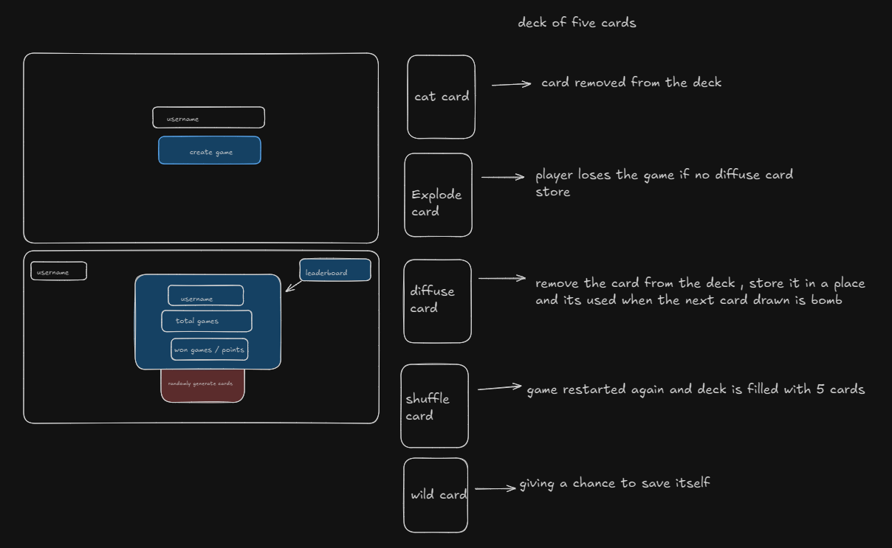
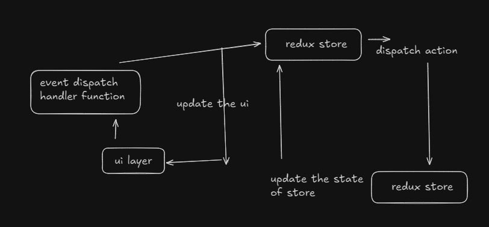

## Shuffle card Game 
lets first see the basic diagram of this game

Next Step:
- if the card count == 4 , point is added to the user.
- if card count < 4 , no point added
- card count == 4 , indicated deck is all cleared.

Tech Stack used:
##### Frontend
- Reactjs
- Redux
- Tailwind Css
- Chakra ui
##### Backend
- Golang
- Redis
- Mongodb

#### Why Reactjs and Redux?
- Reactjs is used for the frontend as it gives the privilege of working with virtaul dom rather than directly communicating with the real dom which obviously takes extra time. And the very best part of this project is that I have used Redux toolkit with react and its actually a very best state management tool which makes easy to manage states and use the same in whichever component its needed. Redux mainly has 3 features -> redux store, dispatch actions, reducer.
- 

  Why Golang and Redis?
  - 
